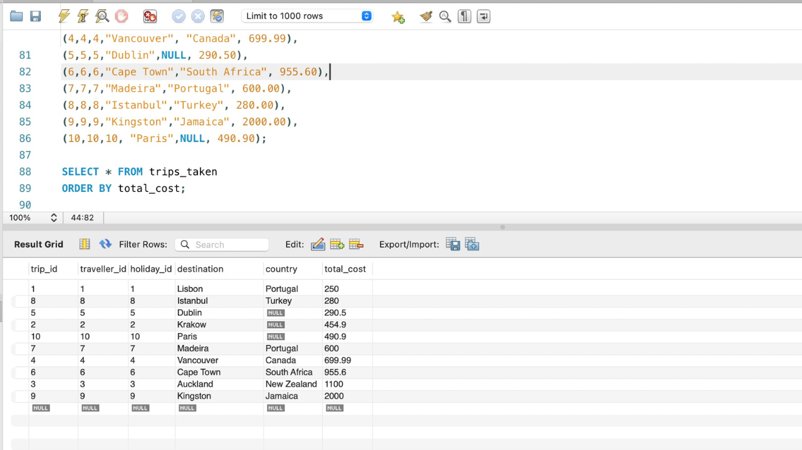
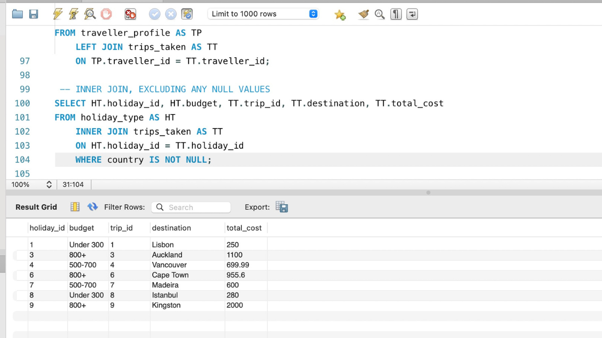
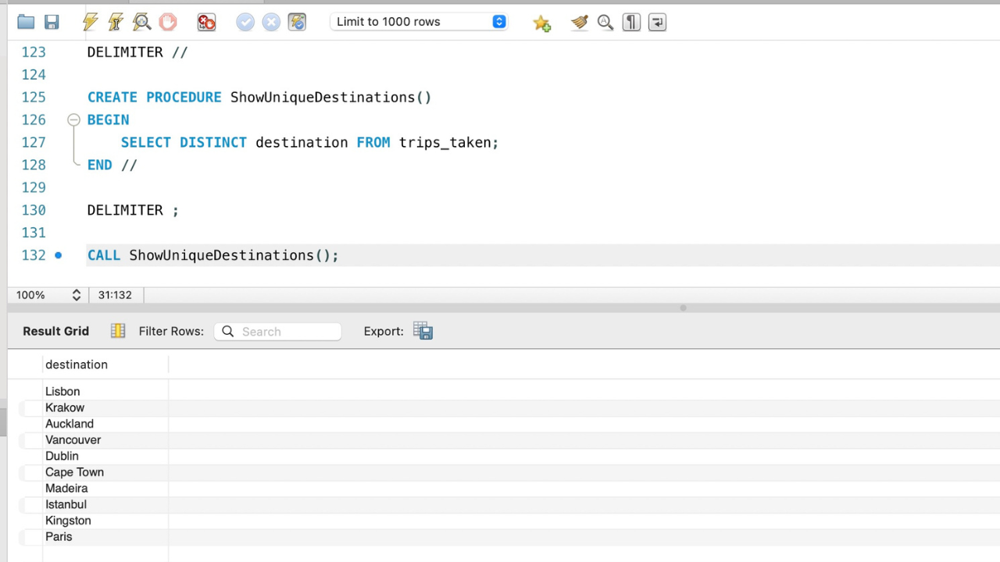

# 🗺️ Travel Trends Tracker - A Mock Travel Agency Database System

 
[Image Credit](https://media4.giphy.com/media/v1.Y2lkPTc5MGI3NjExYWkzOWFleDEwdW9yaDRlYWFicnc5cXN5YWRiaTg2a24wMXdhZDJzdiZlcD12MV9pbnRlcm5hbF9naWZfYnlfaWQmY3Q9Zw/UI6nnmio98eoE/giphy.gif)

## 📝 Project Description
Travel Trends Tracker is a relational SQL database designed for a fictional travel agency to track and analyse travel behaviours from a small selection of travellers.

This project includes:
- Structured relational table design
- Mock data population across multiple tables
- Various SQL queries to extract insights such as cost breakdown, trip types, and destinations
- Use of JOINS, aggregates, stored procedures, and constraints

This showcases essential skills in database design, querying and data management - key aspects for anyone in data science and analytics!

## ⭐️ Features

- Three related tables: `traveller_profile`, `holiday_type` and `trips_taken`
- Use of `PRIMARY KEY` and `FOREIGN KEY` relationship to ensure data integrity
- Inserted mock data that reflects real-world themes (age group, destination, budget, etc.)
- Sample queries include:
  - Average cost per day for solo travellers
  - Holiday types categorised by budget
  - Destinations filtered by those with valid country data
  - A stored procedure to list all unique travel destinations
- Data sorted using `ORDER BY` and refined using various built-in SQL functions

## ⚙️ Setup Instructions
To run this project:
1. Use a local SQL environment like MySQL Workbench or DBeaver. **NOTE**: ⚠️ This project was written using MySQL, so some syntax and functions may vary if you're using other SQL dialects like PostgreSQL or SQLite
2. Create a new database using: `CREATE DATABASE TRAVEL_TRENDS;`
3. Copy and run the 'Travel_Trends_Tracker.sql' file provided in the repo to:
   - Create all tables
   - Insert mock data
   - Execute various SELECT and JOIN queries
   - Create and call the stored procedure

*You can comment out or remove any demo queries you don't plan to run.*

## 🖥️ Output
*Here are some of the performed SQL queries in the database*:

### Example - Basic `SELECT` query

 

### Example - `INNER JOIN` query between `holiday_type` and `trips_taken`

 

### Example - `STORED PROCEDURE` output for unique destinations

## 🧩 Challenges
- Due to the simplicity of this project, there are a few areas for improvement:
  - Budget values are currently stored as strings, which limits numerical operations. Storing them as integers or ranges would allow for more accurate analysis.
  - No date fields were included, so it's not possible to track trip durations or peak travel months/seasons.
  - Lack of validation for duplicate or inconsistent data, such as repeated destinations or `NULL` countries. Adding stricter constraints would improve data integrity.

## 💡What I've Learnt
- How to write and structure a relational database
- Linking tables using foreign keys to ensure integrity
- Applying aggregate functions (`AVG`, `COUNT`) and built-in functions (`CONCAT`, `DISTINCT`)
- Creating and calling stored procedures
- Best practices for query formatting, naming conventions, and avoiding data redundancy

